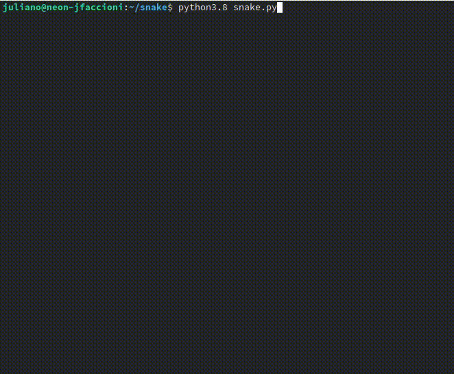

# python-snake-game
Simple Snake game written with Python's standard library.

### How to run

* Download/clone the repo
* In the terminal `cd` into the repo directory
* Write `python snake.py` and press enter. Voilà!

### Requirements
This project requires no dependencies other than Python itself.

The game was written in Python 3.8, it probably runs in Python 3.7 too. Maybe Python 3.6 as well? Be my guest to try it out ;-)
